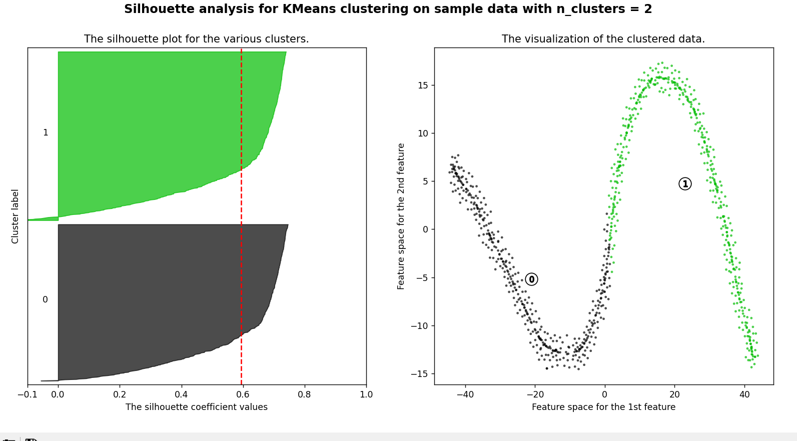
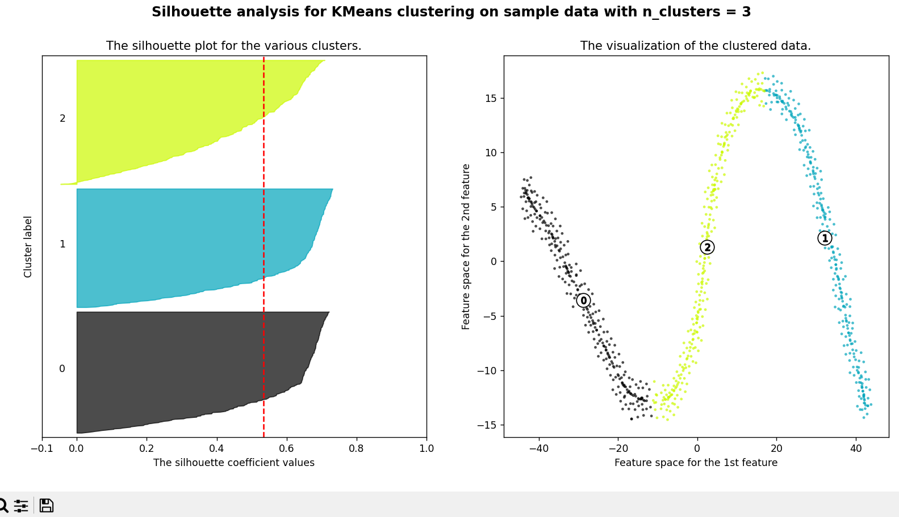
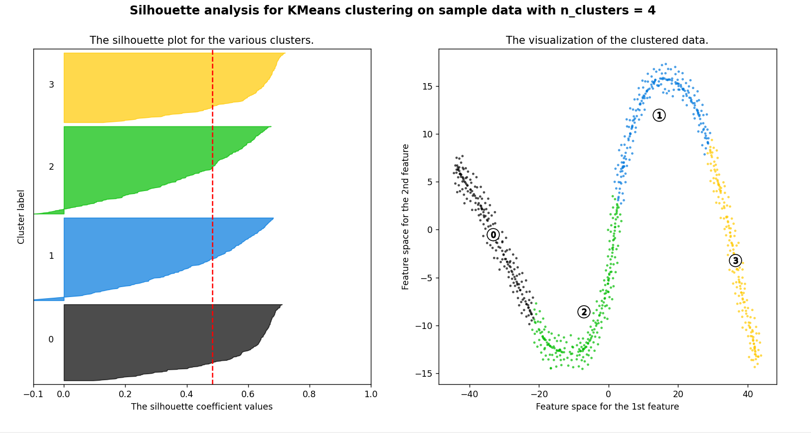
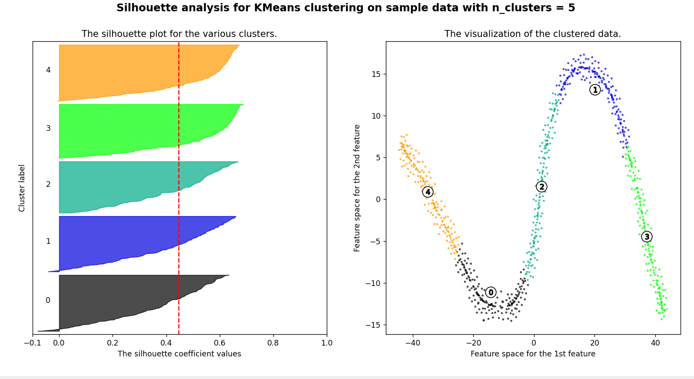
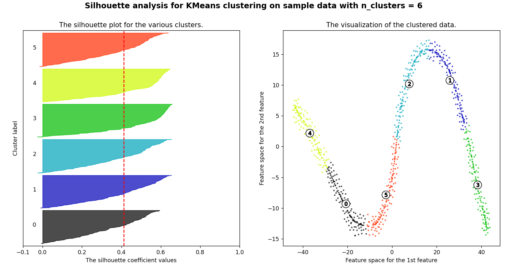

## These plots show the silhouette plots for N clusters of the dataset, where 2 <= N <= 6

An average silhouette score >= 0.5 reflects a good clustering, so we'll use 3 clusters (average silhouette score = 0.53).