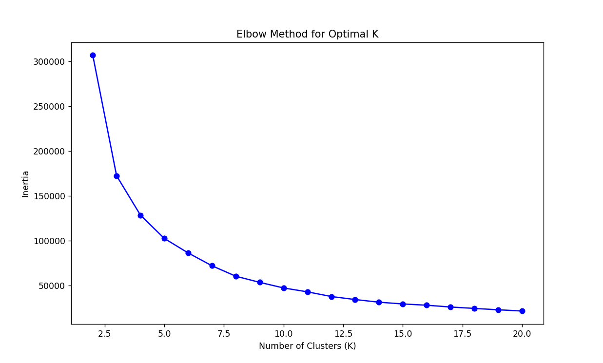

## This plot shows the change in variation for K clusters of the dataset, where 2 <= N <= 20.

The variation decreases the most significantly at K = 2 and K = . Based on the results from the silhouette analysis, a K value of 3 will be used for clustering.